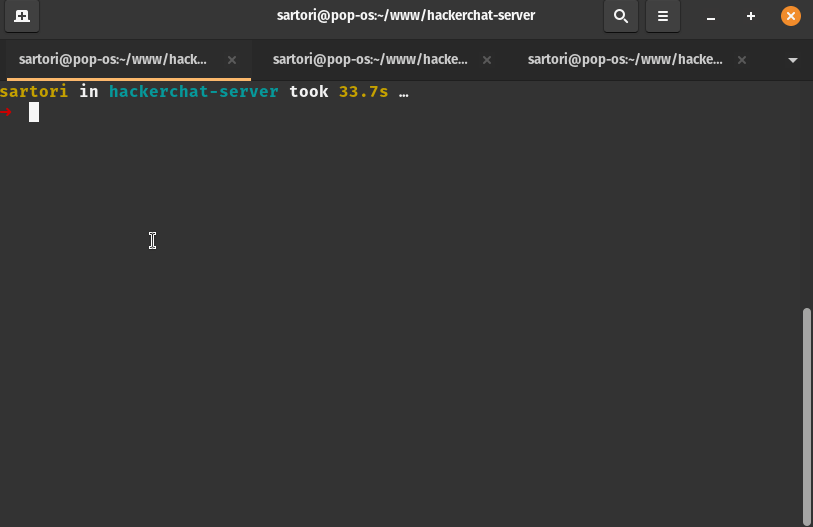

<p align="center">
  
</p>

<h3 align="center">
  Hackerchat Server
</h3>

<blockquote align="center">Chat service built using websockets, designed to accommodate clients connecting from various client types.</blockquote>
<br>

<p align="center">
  <a href="#about-the-project">About the project</a><br>
  <a href="#installation">Installation</a><br>
  <a href="#starting-a-server">Starting a server</a>
  <a href="#deploying-a-server">Deploying a server</a>
</p>

## About the project

Hackerchat is an HTTP service that operates with websockets, enabling users to create and join rooms to exchange messages.

It is adaptable to various interfaces, including web, mobile, desktop, and more. As demonstrated in the gif, I utilized a simple terminal interface to interact with the server.

The Hackerchat server exclusively manages backend communications and lacks a built-in frontend interface. However, users have the flexibility to develop their own interface or choose from existing options provided in this project, such as the <a href="https://github.com/matheussartori/hackerchat-terminal-client">terminal client</a>

### Installation

To launch the server, you must install the Node dependencies and ensure a Node engine version of 20 or higher. To install the modules:

```bash
npm install
```

### Starting a server

To initiate a server, you can specify the port using the `PORT` environment variable, for instance, on Linux:

```bash
PORT=3000 npm run dev
```

Since this project uses TypeScript, you need to run `npm run build` before `npm start`, or you can simply run `npm run dev` to run the project with <a href="https://www.npmjs.com/package/ts-node" target="_blank">ts-node</a> on the src folder.

### Deploying a server

To deploy the Hackerchat application, follow these steps:

1. Ensure Node.js Compatibility:

Make sure your server environment supports Node.js version 20 or higher.
Confirm that the server is capable of handling WebSocket connections.

2. Clone the Repository:

```
git clone git@github.com:matheussartori/hackerchat-server.git
```

3. Navigate to Project Directory:

```
cd hackerchat-server
```

4. Install the required dependencies using npm:

```
npm install
```

5. Initiate the Hackerchat server by running:
```
npm run build && PORT=3000 npm start
```

Your Hackerchat application is now deployed and ready for use.
